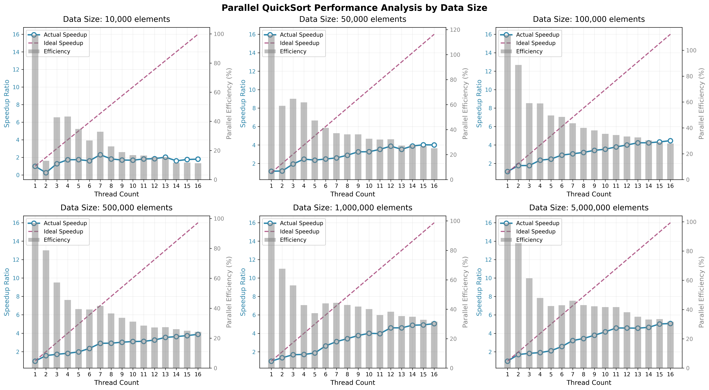

# 任务1 - 使用OpenMP实现并行快速排序算法

## 任务描述

1. 使用使用QT或者OpenMP编程实现并行快速排序算法
2. 测试程序在1K、5K、10K、100K等不同数据量以及在不同线程数情况下的加速比
3. 可以使用其他语言的以及其他线程库
4. 但是不可以直接调用库函数或者开源项目提供的直接可以完成并行快速排序的接口

## 并行快速排序实现

实现基于快速排序, 在此基础上进行了若干优化以提高并行效率与排序稳定性: 
- 基准选择: 采用三数取中作为 pivot, 以减少最坏情况的概率并提高分割质量 
- 小数组处理: 当子数组长度小于 INSERTION_THRESHOLD 时, 使用插入排序, 以减少递归与交换开销 
- 并行策略: 使用 OpenMP task 并行化两侧子数组的递归, 设置 PARALLEL_THRESHOLD 仅当子问题足够大时才创建并行任务, 较小的子问题顺序执行, 避免任务过多带来的调度开销
- 任务粒度与深度控制: 通过传递 depth 参数并结合 omp_get_max_threads() 控制并行深度, 防止线程过度创建与上下文切换 

## 性能测试结果与分析

- 总体趋势: 
  - 随着数据规模增大, 使用并行线程数增多时的加速比总体呈上升趋势, 尤其在中大型数据上并行化收益明显 
  - 对于非常大的数据, 在合适线程数下, 加速比可达到 3x–5x 左右 
- 效率观察: 
  - 对于小规模数据(10K), 并行效率通常较低, 甚至出现并行时间更长的情况, 原因是并行与调度开销超过并行收益 
  - 随着问题增大, 效率有所回升, 但仍受限于内存带宽、缓存一致性与线程竞争 

